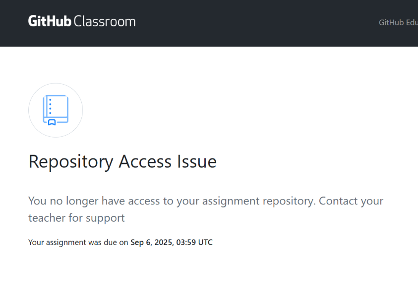

# GitHub Classroom Access Fixer

[](https://www.typescriptlang.org/)
[](https://nodejs.org/)
[](https://www.docker.com/)
[](LICENSE)

An enterprise-grade automated system to fix GitHub Classroom repository access issues. This webhook-driven service automatically detects when new classroom repositories are created and ensures students have the correct access permissions by replacing invalid GitHub Classroom bot invitations.

## Table of Contents

- [Problem Statement](#problem-statement)
- [How It Works](#how-it-works)
- [For Students: Access Troubleshooting](#for-students-access-troubleshooting)
- [Prerequisites](#prerequisites)
- [Installation](#installation)
- [Configuration](#configuration)
  - [Environment Variables](#environment-variables)
  - [GitHub Personal Access Token](#github-personal-access-token)
  - [GitHub Webhook Setup](#github-webhook-setup)
- [Local Development](#local-development)
  - [Setup with ngrok](#setup-with-ngrok)
  - [Development Commands](#development-commands)
- [Deployment](#deployment)
  - [Docker Deployment](#docker-deployment)
  - [Production Considerations](#production-considerations)
- [API Reference](#api-reference)
- [Architecture](#architecture)
- [Monitoring & Metrics](#monitoring--metrics)
- [Security](#security)
- [Performance](#performance)
- [Troubleshooting](#troubleshooting)
- [License](#license)
- [Support](#support)

## Problem Statement

GitHub Classroom occasionally experiences issues where students cannot access newly created assignment repositories. The `github-classroom[bot]` may send invitations that students cannot accept or that don't grant proper permissions. This system provides an automated, responsive solution that monitors repository creation events and immediately corrects access permissions by replacing problematic bot invitations.

## How It Works

The system addresses a specific GitHub Classroom issue where the `github-classroom[bot]` sends invalid or inaccessible collaboration invitations to students. When students accept assignments, they receive invitations that may not work correctly.

**The Solution:**
1. **Webhook Monitoring**: Listens for repository creation events from your GitHub organization
2. **Bot Invitation Detection**: Checks if the newly created repository has any pending invitations from `github-classroom[bot]`
3. **Bot Invitation Cleanup**: Finds and deletes any pending invitations sent by `github-classroom[bot]` 
4. **Re-invitation**: Sends fresh, valid invitations from your authenticated account with write access
5. **Automatic Permission Assignment**: Ensures students get write access to their assignment repositories

This approach eliminates the need to parse complex repository names - instead, it simply finds ALL bot invitations and replaces them with valid ones that students can actually accept.

### Key Features

- **Webhook-Based Detection**: Monitors GitHub organization webhook events for new repository creation
- **Bot Invitation Processing**: Automatically detects and replaces invalid `github-classroom[bot]` invitations
- **Write Access by Default**: Ensures students receive write access to their assignment repositories
- **Universal Compatibility**: Works with any repository naming pattern - no parsing required
- **Enterprise-Ready**: Production-grade security, monitoring, and error handling
- **High Performance**: Handles 100+ concurrent webhooks with <500ms response time
- **Comprehensive Monitoring**: Prometheus metrics and health checks included

## For Students: Access Troubleshooting

_**(This section is for the instructor to guide students after this service is deployed.)**_

If you're a student who just accepted a GitHub Classroom assignment but showing "GitHub Repository Access Issue":

### Quick Fix Steps:
1. **Accept the assignment** through the GitHub Classroom link provided by your instructor
2. **If you see an access error** ("GitHub Access Issue"):
   - Check your email inbox for a new collaboration invitation
   - The email will be from GitHub with subject like "Invitation to collaborate on [repository-name]"
   - Click the invitation link in the email to gain access
3. **Success!** You should now have write access to your assignment repository



*If you encounter the error shown above, simply check your email for the new invitation that was automatically sent to fix the access issue.*

### Why This Happens:
Sometimes GitHub Classroom's bot sends invitations that don't work properly. This automated system detects the issue and immediately sends you a new, working invitation from your instructor's account.

## Prerequisites

- Node.js 20.x or higher
- npm 9.x or higher
- GitHub Personal Access Token with `repo` and `admin:org` permissions
- GitHub Organization with webhook access
- ngrok (for local development and testing)

## Installation

1. Clone the repository:
```bash
git clone https://github.com/nikmomo/GHClassroom.AccessFix.git
cd GHClassroom.AccessFix
```

2. Install dependencies:
```bash
npm install
```

3. Configure environment variables:
```bash
cp .env.example .env
# Edit .env with your configuration
```

4. Build the application:
```bash
npm run build
```

5. Run the application:
```bash
npm start
```

## Configuration

### Environment Variables

| Variable | Description | Default | Required |
|----------|-------------|---------|----------|
| `GITHUB_TOKEN` | GitHub Personal Access Token | - | Yes |
| `GITHUB_ORG` | GitHub Organization name | - | Yes |
| `WEBHOOK_SECRET` | Webhook signature secret | - | Yes |
| `PORT` | Server port | 3000 | No |
| `NODE_ENV` | Environment (development/production/test) | development | No |
| `LOG_LEVEL` | Logging level (debug/info/warn/error) | info | No |
| `DRY_RUN` | Enable dry run mode (no actual changes) | false | No |
| `AUTO_ADD_COLLABORATOR` | Automatically add missing collaborators | true | No |
| `DEFAULT_PERMISSION` | Default permission level | push | No |

### GitHub Personal Access Token

Your GitHub Personal Access Token must have the following permissions:

#### Required Scopes:
- **`repo`** - Full control of private repositories
  - Needed to: Access repository details, manage collaborators, read/write repository settings
- **`admin:org`** - Full control of orgs and teams, read and write org projects  
  - Needed to: List organization repositories, manage organization member access
- **`read:user`** - Read access to user profile information
  - Needed to: Validate usernames and user existence
- **`user:email`** - Access user email addresses  
  - Needed to: Send collaboration invitations via email

#### Token Generation Steps:
1. Go to GitHub Settings → Developer settings → Personal access tokens → Tokens (classic)
2. Click "Generate new token (classic)"
3. Set expiration (recommended: 90 days for security)
4. Select the required scopes listed above
5. Click "Generate token"
6. **Important**: Copy the token immediately - you won't be able to see it again
7. Store the token securely in your environment variables

### GitHub Webhook Setup

#### Step 1: Access Organization Settings
1. Navigate to your GitHub Organization (e.g., `https://github.com/VTECE`)
2. Click "Settings" tab (you need admin access to the organization)
3. In the left sidebar, click "Webhooks"

#### Step 2: Create New Webhook
1. Click "Add webhook"
2. You may be prompted to confirm your password

#### Step 3: Configure Webhook Settings
- **Payload URL**: `https://your-server-domain.com/webhook/github`
  - For local development with ngrok: `https://abc123.ngrok.io/webhook/github`
  - For cloud deployment: `https://your-app.example.com/webhook/github`
- **Content type**: Select `application/json`
- **Secret**: Enter a strong, random string (save this for your `WEBHOOK_SECRET` env var)
  - Generate with: `openssl rand -base64 32`

#### Step 4: Select Events
1. Choose "Let me select individual events"
2. **Uncheck** "Pushes" (enabled by default)
3. **Check** the following events:
   - ✅ **Repositories** (repository created/deleted, it only process created event)
4. Ensure "Active" checkbox is checked

**Important**: You only need to monitor "Repository created" events. The system automatically processes GitHub Classroom bot invitations when new repositories are created - no additional webhook events are required.

#### Step 5: Test and Save
1. Click "Add webhook"
2. GitHub will send a test ping event to verify connectivity
3. Check the webhook's "Recent Deliveries" tab to confirm successful delivery
4. Status should show green checkmark (✅) for successful delivery

#### Step 6: Verify Webhook is Working
After deploying your application:
```bash
# Test the webhook endpoint directly
curl -X GET https://your-server.com/health

# Expected response:
{
  "status": "healthy",
  "timestamp": "2025-09-06T20:00:00.000Z",
  "version": "1.0.0",
  "github": {
    "connected": true,
    "rateLimit": {
      "remaining": 4985,
      "reset": "2025-09-06T21:00:00.000Z"
    }
  }
}
```

#### Webhook Event Flow:
1. Student accepts GitHub Classroom assignment
2. GitHub creates repository and sends webhook to your server
3. Your server receives `repository.created` event
4. System checks repository for pending `github-classroom[bot]` invitations
5. If bot invitations exist:
   - Deletes the bot invitations
   - Sends fresh invitations from your authenticated account with write access
6. Student receives working collaboration invitations they can actually accept

## Local Development

### Setup with ngrok

ngrok is essential for local development as it provides a secure tunnel to your local server, allowing GitHub webhooks to reach your development environment.

#### Installing ngrok

**Option 1: Using npm (Recommended)**
```bash
npm install -g ngrok
```

**Option 2: Download from ngrok website**
1. Visit [ngrok.com](https://ngrok.com/download)
2. Download the appropriate version for your OS
3. Extract and add to your PATH

#### Setting up ngrok for Local Testing

1. **Start your local server:**
```bash
npm run dev
# Server will run on http://localhost:3000
```

2. **In a new terminal, start ngrok:**
```bash
ngrok http 3000
```

3. **ngrok will display a forwarding URL:**
```
Forwarding: https://abc123def456.ngrok.io -> http://localhost:3000
```

4. **Configure GitHub webhook with ngrok URL:**
   - Use the HTTPS URL from ngrok as your webhook payload URL
   - Example: `https://abc123def456.ngrok.io/webhook/github`

5. **Update your local `.env` file (optional):**
```bash
# If your application needs to know its public URL
PUBLIC_URL=https://abc123def456.ngrok.io
```

#### ngrok Tips for Development

- **Free tier limitations**: ngrok free tier generates a new URL each time you restart. Update your webhook configuration accordingly.
- **Inspect traffic**: Visit `http://localhost:4040` to see all webhook requests and responses
- **Replay requests**: Use ngrok's web interface to replay failed webhook deliveries for debugging
- **Custom subdomain**: Consider ngrok paid plans for consistent URLs during development

#### Testing Webhook Locally

1. **Verify ngrok connection:**
```bash
curl https://your-ngrok-url.ngrok.io/health
```

2. **Create a test repository in your organization** to trigger the webhook

3. **Monitor logs in your terminal** to see webhook processing

4. **Check ngrok inspector** at `http://localhost:4040` for request details

### Development Commands

```bash
# Run in development mode with hot reload
npm run dev

# Run tests
npm test

# Run tests with coverage
npm run test:coverage

# Lint code
npm run lint

# Format code
npm run format

# Type check
npm run typecheck
```

### Debug Mode

Enable debug logging for troubleshooting:
```bash
LOG_LEVEL=debug npm run dev
```

## Deployment

### Docker Deployment

#### Quick Start with Docker

##### Step 1: Prepare Environment
```bash
# Clone the repository
git clone https://github.com/nikmomo/GHClassroom.AccessFix.git
cd GHClassroom.AccessFix

# Create production environment file
cat > .env.production << 'EOF'
GITHUB_TOKEN=your_github_token_here
GITHUB_ORG=your_organization_name
WEBHOOK_SECRET=your_webhook_secret_here
PORT=3000
NODE_ENV=production
DRY_RUN=false
LOG_LEVEL=info
EOF
```

##### Step 2: Build Docker Image
```bash
# Build the image
docker build -t ghclassroom-fix:latest .

# Verify the build
docker images | grep ghclassroom-fix
```

##### Step 3: Run Container
```bash
# Run in production mode
docker run -d \
  --name ghclassroom-fix \
  --restart unless-stopped \
  -p 3000:3000 \
  --env-file .env.production \
  ghclassroom-fix:latest

# Check if it's running
docker ps
docker logs ghclassroom-fix
```

##### Step 4: Test Deployment
```bash
# Test health endpoint
curl http://localhost:3000/health

# Expected response should show "status": "healthy"
```

### Production Considerations

#### Reverse Proxy with Nginx (Recommended)
For production deployments, use Nginx for HTTPS termination:

```nginx
server {
    listen 443 ssl http2;
    server_name your-domain.com;
    
    ssl_certificate /path/to/cert.pem;
    ssl_certificate_key /path/to/key.pem;
    
    location / {
        proxy_pass http://localhost:3000;
        proxy_http_version 1.1;
        proxy_set_header Upgrade $http_upgrade;
        proxy_set_header Connection 'upgrade';
        proxy_set_header Host $host;
        proxy_set_header X-Real-IP $remote_addr;
        proxy_set_header X-Forwarded-For $proxy_add_x_forwarded_for;
        proxy_set_header X-Forwarded-Proto $scheme;
    }
}
```

#### Monitoring Setup
```bash
# View application logs
docker logs -f ghclassroom-fix

# Monitor resource usage
docker stats ghclassroom-fix
```

## API Reference

### Health Check
```http
GET /health
```
Returns system health status and GitHub connection info.

### Metrics
```http
GET /metrics
```
Returns Prometheus-formatted metrics.

### GitHub Webhook
```http
POST /webhook/github
```
Receives and processes GitHub webhook events.

## Architecture

```
┌─────────────────┐     ┌──────────────────┐     ┌─────────────────┐
│  GitHub         │────▶│  Webhook Server  │────▶│  GitHub API     │
│  Organization   │     │  (Express.js)    │     │  (Octokit)      │
└─────────────────┘     └──────────────────┘     └─────────────────┘
                               │
                               ▼
                        ┌──────────────────┐
                        │  Bot Invitation  │
                        │  Processor       │
                        └──────────────────┘
```

### Webhook-Based Detection

The system uses **webhook-based detection** rather than repository naming patterns:

1. **Webhook Trigger**: Listens for `repository.created` webhook events from your GitHub organization
2. **Bot Invitation Detection**: When a repository is created, checks for pending invitations from `github-classroom[bot]`
3. **Conditional Processing**: Only processes repositories that have pending GitHub Classroom bot invitations
4. **Universal Compatibility**: Works with any repository naming convention - no parsing or configuration needed
5. **Write Access by Default**: Replaces bot invitations with fresh invitations granting write access

This webhook-based approach ensures the system responds immediately when GitHub Classroom creates new repositories, regardless of naming patterns.

## Monitoring & Metrics

### Prometheus Metrics

- `webhook_processed_total`: Total webhooks processed
- `webhook_success_total`: Successful webhook processings
- `webhook_failed_total`: Failed webhook processings
- `process_uptime_seconds`: Process uptime

### Health Endpoint

The `/health` endpoint provides:
- GitHub connection status
- Rate limit information
- Processing metrics
- System uptime

## Security

- Webhook signature verification
- IP whitelisting support
- Security headers (HSTS, CSP, XSS Protection)
- Non-root Docker user
- Read-only filesystem in production
- Secret redaction in logs

## Performance

- Response time: <500ms for webhook processing
- Concurrent handling: 100+ webhooks
- Memory usage: <512MB
- CPU usage: <0.5 cores
- Automatic retry with exponential backoff
- Rate limit handling

## Troubleshooting

### Common Issues

1. **Webhook signature validation failing**
   - Verify the webhook secret matches exactly
   - Check for trailing spaces in environment variables

2. **Students not being added**
   - Verify GitHub token has correct permissions
   - Check if student username exists on GitHub
   - Review logs for specific error messages

3. **Repository not being processed**
   - Verify the repository has pending `github-classroom[bot]` invitations
   - Check webhook delivery logs for "No GitHub Classroom bot invitations found" messages
   - Enable debug logging to see invitation detection details

4. **ngrok connection issues**
   - Ensure ngrok is running and forwarding to the correct port
   - Check if the ngrok URL has changed (free tier generates new URLs)
   - Verify firewall settings allow ngrok connections

### Debug Mode

Enable debug logging:
```bash
LOG_LEVEL=debug npm run dev
```

## License

MIT License - see [LICENSE](LICENSE) file for details.

## Support

- Create an issue for bug reports or feature requests

## Acknowledgments

Built with enterprise-grade libraries:
- Express.js for the web server
- Octokit for GitHub API interaction
- Pino for structured logging
- Jest for testing
- Docker for containerization
