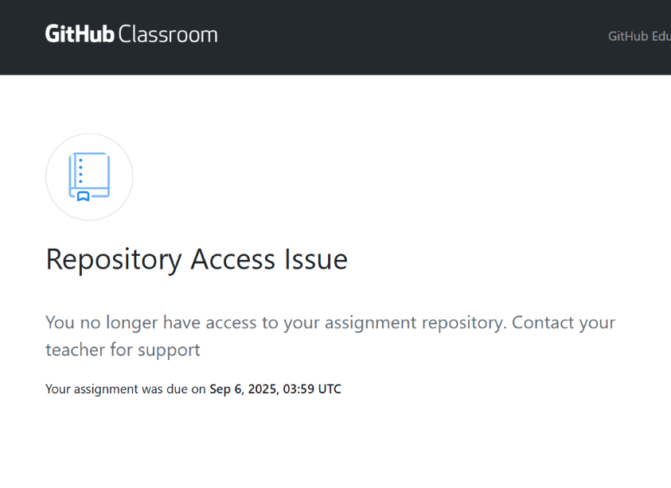

# GitHub Classroom Access Fixer

[](https://www.typescriptlang.org/)
[](https://nodejs.org/)
[](https://www.docker.com/)
[](LICENSE)

A webhook service that automatically fixes GitHub Classroom repository access issues. When `github-classroom[bot]` sends broken invitations to students, this service detects it, removes the bad invitations, and sends working ones.

## How It Works

1. A student accepts a GitHub Classroom assignment
2. GitHub creates a repo and fires a webhook to this service
3. The service checks for pending `github-classroom[bot]` invitations
4. If found, it deletes them and sends fresh invitations with write access
5. The student receives a working invitation via email

## For Students

If you see a "Repository Access Issue" error after accepting an assignment:

1. Check your email for a new collaboration invitation from GitHub
2. Click the invitation link
3. You now have access



---

## Setup

Pick one path: **Local** (for development/testing) or **Cloud** (for production).

Both paths require the same prerequisites:

- A GitHub **Personal Access Token** (classic) with scopes: `repo`, `admin:org`, `read:user`, `user:email`
  - Generate at: GitHub Settings > Developer settings > Personal access tokens > Tokens (classic)
- A **GitHub Organization** where you have admin access

### Path A: Local Setup

Use this for development and testing. You'll use [Cloudflare Tunnel](https://developers.cloudflare.com/cloudflare-one/connections/connect-networks/do-more-with-tunnels/trycloudflare/) to expose your local server to GitHub webhooks — no account required.

**Step 1: Clone and install**

```bash
git clone https://github.com/nikmomo/GHClassroom.AccessFix.git
cd GHClassroom.AccessFix
npm install
```

**Step 2: Configure environment**

```bash
cp .env.example .env
```

Edit `.env` and fill in:

```
GITHUB_TOKEN=ghp_your_token_here
GITHUB_ORG=your-org-name
WEBHOOK_SECRET=any-strong-random-string
```

Generate a webhook secret with: `openssl rand -base64 32`

**Step 3: Start Cloudflare Tunnel**

```bash
# Install cloudflared: https://developers.cloudflare.com/cloudflare-one/connections/connect-networks/downloads/
# macOS: brew install cloudflared
# Windows: winget install --id Cloudflare.cloudflared
# Linux: see link above

# In a separate terminal, start the tunnel
cloudflared tunnel --url http://localhost:3000
```

Copy the generated URL (e.g., `https://random-words.trycloudflare.com`).

**Step 4: Set up the GitHub webhook**

1. Go to your GitHub Organization > Settings > Webhooks > Add webhook
2. **Payload URL**: `https://random-words.trycloudflare.com/webhook/github` (your tunnel URL + `/webhook/github`)
3. **Content type**: `application/json`
4. **Secret**: the same `WEBHOOK_SECRET` from your `.env`
5. Under "Which events?", select **"Let me select individual events"**
   - Uncheck "Pushes"
   - Check **"Repositories"**
6. Click "Add webhook"

**Step 5: Start the server**

```bash
npm run dev
```

Test it: `curl http://localhost:3000/health`

You're done! Create a test repository in your org to trigger the webhook.

> **Note**: The free tunnel generates a new URL on each restart. Update the webhook Payload URL accordingly.

---

### Path B: Cloud Setup

Use this for production. You need a server with a public IP/domain and HTTPS.

**Step 1: Clone and install on your server**

```bash
git clone https://github.com/nikmomo/GHClassroom.AccessFix.git
cd GHClassroom.AccessFix
npm install --production
```

**Step 2: Configure environment**

```bash
cp .env.example .env.production
```

Edit `.env.production`:

```
GITHUB_TOKEN=ghp_your_token_here
GITHUB_ORG=your-org-name
WEBHOOK_SECRET=any-strong-random-string
PORT=3000
NODE_ENV=production
LOG_LEVEL=info
```

**Step 3: Build and run**

Choose **one** of the following:

<details>
<summary><strong>Option 1: Node.js + PM2</strong></summary>

```bash
npm run build
npm install -g pm2
pm2 start dist/index.js --name ghclassroom-fix
pm2 save && pm2 startup
```

</details>

<details>
<summary><strong>Option 2: Docker</strong></summary>

```bash
docker build -t ghclassroom-fix:latest .
docker run -d \
  --name ghclassroom-fix \
  --restart unless-stopped \
  -p 3000:3000 \
  --env-file .env.production \
  ghclassroom-fix:latest
```

</details>

**Step 4: Set up the GitHub webhook**

1. Go to your GitHub Organization > Settings > Webhooks > Add webhook
2. **Payload URL**: `https://your-server.com/webhook/github`
3. **Content type**: `application/json`
4. **Secret**: the same `WEBHOOK_SECRET` from your env file
5. Under "Which events?", select **"Let me select individual events"**
   - Uncheck "Pushes"
   - Check **"Repositories"**
6. Click "Add webhook"

**Step 5: Verify**

```bash
curl https://your-server.com/health
```

You should see `"status": "healthy"` with GitHub connection info.

> **Recommended**: Put an Nginx reverse proxy in front for HTTPS termination. See [Nginx example config](#nginx-reverse-proxy).

---

## Configuration Reference

### Environment Variables

| Variable | Required | Default | Description |
|----------|----------|---------|-------------|
| `GITHUB_TOKEN` | Yes | - | GitHub Personal Access Token |
| `GITHUB_ORG` | Yes | - | GitHub Organization name |
| `WEBHOOK_SECRET` | Yes | - | Webhook signature secret |
| `PORT` | No | `3000` | Server port |
| `NODE_ENV` | No | `development` | `development` / `production` / `test` |
| `LOG_LEVEL` | No | `info` | `debug` / `info` / `warn` / `error` |
| `DRY_RUN` | No | `false` | If `true`, logs actions without making changes |
| `AUTO_ADD_COLLABORATOR` | No | `true` | Auto-add students as collaborators |
| `DEFAULT_PERMISSION` | No | `push` | Permission level for students |

### API Endpoints

| Method | Path | Description |
|--------|------|-------------|
| `GET` | `/health` | Health check with GitHub connection status |
| `GET` | `/metrics` | Prometheus-formatted metrics |
| `POST` | `/webhook/github` | GitHub webhook receiver |

---

## Development

```bash
npm run dev              # Start with hot reload
npm test                 # Run tests
npm run test:coverage    # Run tests with coverage
npm run lint             # Lint code
npm run format           # Format code
npm run typecheck        # Type check
LOG_LEVEL=debug npm run dev  # Debug mode
```

## Architecture

```
GitHub Organization ──webhook──▶ Express.js Server ──API──▶ GitHub API (Octokit)
                                       │
                                       ▼
                               Bot Invitation Processor
                               (detect → delete → re-invite)
```

## Nginx Reverse Proxy

For production HTTPS termination:

```nginx
server {
    listen 443 ssl http2;
    server_name your-domain.com;

    ssl_certificate /path/to/cert.pem;
    ssl_certificate_key /path/to/key.pem;

    location / {
        proxy_pass http://localhost:3000;
        proxy_http_version 1.1;
        proxy_set_header Host $host;
        proxy_set_header X-Real-IP $remote_addr;
        proxy_set_header X-Forwarded-For $proxy_add_x_forwarded_for;
        proxy_set_header X-Forwarded-Proto $scheme;
    }
}
```

## Troubleshooting

| Problem | Solution |
|---------|----------|
| Webhook signature failing | Verify `WEBHOOK_SECRET` matches exactly (no trailing spaces) |
| Students not being added | Check token permissions (`repo`, `admin:org`, `read:user`, `user:email`) |
| Repo not processed | Confirm the repo has pending `github-classroom[bot]` invitations; enable debug logging |
| Tunnel not working | Ensure `cloudflared` is running, check if URL changed (new URL per restart), verify firewall |

## License

MIT - see [LICENSE](LICENSE)
